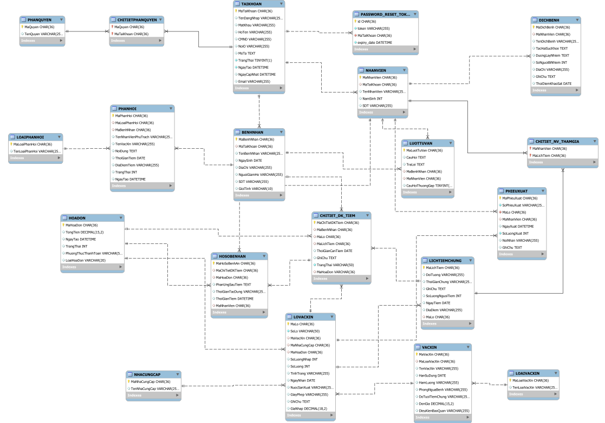

# 💉 VaxTrack Pro - Hệ thống Quản lý Tiêm chủng & Tài chính Tập trung
**VaxTrack Pro** là giải pháp quản trị tổng thể cho các trung tâm y tế dự phòng, được thiết kế theo chuẩn SRS v3.0. Hệ thống giải quyết bài toán cấp thiết trong việc bảo vệ cộng đồng khỏi dịch bệnh thông qua quản lý tiêm chủng, cơ sở vật chất và tài chính minh bạch.

## 👥 Hệ thống Phân quyền (Role-Based Access Control)

Dựa trên yêu cầu nghiệp vụ, hệ thống chia người dùng thành 3 nhóm chính với 6 vai trò cụ thể:

- **Administrator:** Toàn quyền quản trị hệ thống, quản lý tài khoản và phân quyền. (username: hieu123, pass: 123456)
- **Moderator (Nhóm điều hành):**
  - **Quản lý kho:** Theo dõi tình hình vắc-xin, thực hiện nhập/xuất kho. (username: khobai01, pass: 123456)
  - **Nhân viên tài chính:** Quản lý giá, thu chi, đối soát giao dịch khách hàng và nhà cung cấp. (username: TaiChinh02, pass: 123456)
  - **Nhân viên y tế:** Trực tiếp khám, cập nhật hồ sơ bệnh án và kê đơn. (username: BacSi02, pass: 123456)
  - **Hỗ trợ khách hàng:** Tư vấn, giải đáp thắc mắc và nhắc lịch tiêm chủng qua Email/SMS. (username: HTKH01, pass: 123456)
  - **Normal User (Khách hàng):** Tra cứu thông tin vắc-xin, đăng ký tiêm phòng trực tuyến và theo dõi hồ sơ cá nhân. (username: BenhNhan02, pass: 123456)

## 🌟 Tính năng cốt lõi theo quy trình SRS

### 1. Quản lý Kho & Logistics

- **Xem tình hình kho:** Tra cứu đa năng theo tên, loại vắc-xin, nơi sản xuất hoặc độ tuổi.
- **Nhập kho tự động:** Tự động tạo hóa đơn tài chính ngay khi thêm lô mới.
- **Xuất kho:** Kiểm soát số lượng xuất thực tế, đảm bảo không xuất quá số lượng tồn.

### 2. Quy trình Y tế Khép kín (E2E)

- **Hồ sơ bệnh án điện tử:** Lưu vết toàn bộ lịch sử tiêm, phản ứng sau tiêm và thời gian tác dụng của vắc-xin.
- **Kê đơn & Hẹn tiêm:** Hỗ trợ bác sĩ kê đơn và lập lịch tiêm nhắc lại cho bệnh nhân.
- **Tư vấn khách hàng:** Hệ thống giải đáp thắc mắc và FAQ tự động cho người dùng.

### 3. Quản trị Tài chính & Giao dịch 

- **Quản lý thu chi:** Thống kê định kỳ doanh thu từ khách hàng và công nợ nhà cung cấp.
- **Biên lai điện tử:** Xuất biên lai giao dịch ngay sau khi hoàn tất quy trình tiêm.

### 4. Một số vấn đề xử lý.
- Sử dụng Enum để quản lý tất cả lỗi RuntimeException.
- Định nghĩa class riêng AppException kế thừa từ RuntimeException.
- Viết class ApiResponse định nghĩa chuẩn để toàn bộ api dự án phải tuân theo.
- Sử dụng Junit và Mockito đề viết unit test và itegration test cho dự án kết hợp CI với Github Actions (Sử dụng H2 database)
- Sử dụng Spring Data Jpa cho truy vấn dự liệu, quản lý quan hệ và phân trang cùng với Hibernate để mapping Entity.
- Spring Security cho Authentication và Authorization.
- Ngoài ra còn sử dụng thêm một số thư viện như:
  
| Thành phần        | Công nghệ                   |
| ----------------- | --------------------------- |
| Authentication    | JWT                         |
| ORM               | Spring Data JPA + Hibernate |
| Database          | MySQL                       |
| Validation        | Bean Validation             |
| Mail service      | Spring Mail                 |
| Testing           | JUnit / Mockito             |
| Boilerplate       | Lombok                      |


## 📊 Thiết kế Cơ sở dữ liệu (Database Schema)
Hệ thống được xây dựng trên một sơ đồ quan hệ (Relational Schema) tối ưu, đảm bảo tính toàn vẹn dữ liệu cho hơn 15 thực thể chính.

- **Core Inventory:** VACXIN, LOAIVACXIN, LOVACXIN, NHACUNGCAP.

- **Finance:** HOADON (Kết nối trung tâm giữa Kho và Bệnh nhân).

- **Clinical:** BENHNHAN, HOSOBENHAN, LICHTIEMCHUNG, PHANHOI.

- **System:** NHANVIEN, TAIKHOAN, PHANQUYEN.



## 🛠 Công nghệ sử dụng
`Backend`

- **Spring Boot 3.x:** Framework chính cho REST API.

- **Spring Security & JWT:** Bảo mật hệ thống và phân quyền dựa trên vai trò.

- **Spring Data JPA:** Quản lý tương tác cơ sở dữ liệu và Transaction.

- **Hibernate:** Xử lý nạp dữ liệu Lazy/Eager và Proxy optimization.

`Frontend`

- **React.js & Vite:** Thư viện giao diện người dùng hiện đại và tốc độ build nhanh.

- **Tailwind CSS:** Framework CSS tối ưu cho giao diện Responsive.

- **Lucide Icons:** Bộ icon vector chuyên nghiệp cho ngành y tế.

## 🚀 Hướng dẫn cài đặt & Thiết lập Database

Dự án cung cấp file db-project-script.sql chứa đầy đủ cấu trúc và dữ liệu mẫu.

**1. Thiết lập Database**

1. Mở MySQL Workbench hoặc Terminal.
2. Tạo database: CREATE DATABASE vaccine_management;
3. Import dữ liệu:

```bash
mysql -u username -p vaccine_management < db-project-script.sql
```

**2. Cấu hình Backend**
Sửa file application.properties:

```Properties
spring.datasource.url=jdbc:mysql://localhost:3306/vaccine_management
spring.datasource.username=your_username
spring.datasource.password=your_password
```

# 💉 VaxTrack Pro - Hệ Thống Quản Lý Tiêm Chủng Vaccine (Dành cho người muốn chạy luôn dự án và không cần phải setup cầu kỳ)

Dự án Full-stack quản lý tiêm chủng (Spring Boot, ReactJS, MySQL) đã được đóng gói hoàn toàn bằng Docker. Người dùng không cần cài đặt môi trường lập trình, chỉ cần duy nhất Docker để khởi chạy.

## 🚀 Hướng dẫn khởi chạy nhanh (Quick Start)

Để chạy hệ thống trên máy tính của bạn, hãy thực hiện theo 3 bước sau:

### 1. Yêu cầu hệ thống
* Đã cài đặt [Docker Desktop](https://www.docker.com/products/docker-desktop/) (Windows/Mac) hoặc Docker Engine (Linux).

### 2. Chuẩn bị file
* Tạo một thư mục mới trên máy tính.
* Tạo một file tên là `docker-compose.yml` trong thư mục đó.
* Sao chép toàn bộ nội dung cấu hình Docker Compose (sử dụng image `nguyenhoanghieu1510/...`) vào file vừa tạo.

### 3. Khởi chạy
Mở Terminal/PowerShell tại thư mục đó và chạy lệnh:
```bash
docker-compose up -d
```

### 🌐 Địa chỉ truy cập
Sau khi chạy lệnh thành công, bạn có thể truy cập hệ thống tại: http://localhost:3000

### 🔑 Tài khoản dùng thử (Demo Data)

| Vai trò (Role)      | Tài khoản (Username) | Mật khẩu (Password) | Mã Tài Khoản (ID)                     | Ghi chú                        |
| ------------------- | -------------------- | ------------------- | ------------------------------------- | ------------------------------ |
| Quản trị viên       | `hieu123`            | `123456`            | `20f2e44e-db16-4a53-875a-15b222f923af`| Toàn quyền quản trị hệ thống   |
| Quản lý kho         | `khobai01`           | `123456`            | `12a7847a-4d75-4f75-8f50-be3f054df15d`| Quản lý vắc-xin, nhập/xuất kho |
| Nhân viên tài chính | `TaiChinh02`         | `123456`            | `720f12c7-9c0e-4a36-8e8a-ad2f8f0ce89b`| Quản lý hóa đơn, doanh thu     |
| Nhân viên y tế      | `BacSi02`            | `123456`            | `7734a5c8-a2a5-4bba-95fd-001b520ee52e`| Khám sàng lọc, kê đơn tiêm     |
| Hỗ trợ khách hàng   | `HTKH01`             | `123456`            | `973b87c5-94a1-4d2d-b69c-df03de36a70d`| Tư vấn, nhắc lịch tiêm chủng   |
| Khách hàng          | `BenhNhan02`         | `123456`            | `cb9fe6a2-b98b-4a76-bcc0-28d49862c48c`| Tra cứu hồ sơ, đặt lịch tiêm   |
  


