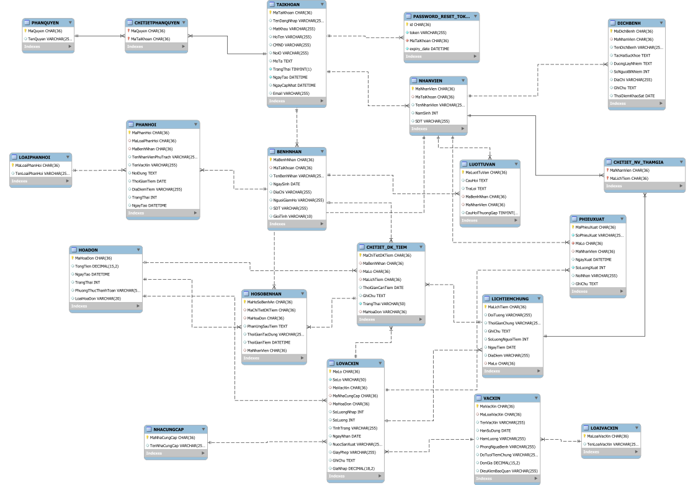

# VaxTrack Pro - Hệ thống Quản lý Tiêm chủng & Tài chính Tập trung
**VaxTrack Pro** là giải pháp quản trị tổng thể cho các trung tâm y tế dự phòng, được thiết kế theo chuẩn SRS v3.0. Hệ thống giải quyết bài toán cấp thiết trong việc bảo vệ cộng đồng khỏi dịch bệnh thông qua quản lý tiêm chủng, cơ sở vật chất và tài chính minh bạch.

## 1. Mục tiêu xây dựng dự án
Dự án VaxTrack Pro được xây dựng với mục tiêu chuyển đổi số quy trình quản lý tiêm chủng thủ công sang hệ thống quản trị tự động, tập trung vào 3 trụ cột chính:

### 1.1 Tối ưu hóa quy trình Y tế (Clinical Efficiency)

- Số hóa hồ sơ: Loại bỏ việc lưu trữ sổ tiêm giấy bằng Hồ sơ bệnh án điện tử, giúp tra cứu lịch sử tiêm chủng của bệnh nhân chỉ trong vài giây.
- Chăm sóc chủ động: Tự động hóa việc lập lịch tiêm nhắc lại và hỗ trợ bác sĩ kê đơn chính xác dựa trên danh mục vắc-xin hiện có.
- An toàn tiêm chủng: Theo dõi sát sao các phản ứng sau tiêm và thời gian tác dụng của từng loại lô vắc-xin.

### 1.2 Quản trị Kho & Tài chính minh bạch (Logistics & Finance)

- Kiểm soát thất thoát: Quản lý chặt chẽ vòng đời vắc-xin từ lúc nhập lô, lưu kho cho đến khi xuất dùng, đảm bảo số lượng tồn kho luôn khớp với thực tế.
- Tự động hóa tài chính: Kết nối trực tiếp nghiệp vụ xuất kho với hóa đơn thanh toán, giúp minh bạch thu chi và dễ dàng đối soát công nợ với nhà cung cấp.

### 1.3 Nâng cao trải nghiệm khách hàng (Customer Experience)

- Tiếp cận thông tin: Cung cấp cổng thông tin trực tuyến để người dân dễ dàng tra cứu loại vắc-xin, giá cả và đăng ký tiêm chủng từ xa.
- Tương tác đa kênh: Xây dựng kênh phản hồi và hỗ trợ giải đáp thắc mắc giữa trung tâm y tế và khách hàng một cách nhanh chóng.

- Giao diện Admin:


- Giao diện User:


## 2. Hệ thống Phân quyền (Role-Based Access Control)

Dựa trên yêu cầu nghiệp vụ, hệ thống chia người dùng thành 3 nhóm chính với 6 vai trò cụ thể:

- **Administrator:** Toàn quyền quản trị hệ thống, quản lý tài khoản và phân quyền.
- **Moderator (Nhóm điều hành):**
  - **Quản lý kho:** Theo dõi tình hình vắc-xin, thực hiện nhập/xuất kho.
  - **Nhân viên tài chính:** Quản lý giá, thu chi, đối soát giao dịch khách hàng và nhà cung cấp.
  - **Nhân viên y tế:** Trực tiếp khám, cập nhật hồ sơ bệnh án và kê đơn.
  - **Hỗ trợ khách hàng:** Tư vấn, giải đáp thắc mắc và nhắc lịch tiêm chủng qua Email/SMS.
  - **Normal User (Khách hàng):** Tra cứu thông tin vắc-xin, đăng ký tiêm phòng trực tuyến và theo dõi hồ sơ cá nhân.

## 3. Tính năng cốt lõi theo quy trình SRS

### 3.1 Quản lý Kho & Logistics

- **Xem tình hình kho:** Tra cứu đa năng theo tên, loại vắc-xin, nơi sản xuất hoặc độ tuổi.
- **Nhập kho tự động:** Tự động tạo hóa đơn tài chính ngay khi thêm lô mới.
- **Xuất kho:** Kiểm soát số lượng xuất thực tế, đảm bảo không xuất quá số lượng tồn.

### 3.2 Quy trình Y tế Khép kín (E2E)

- **Hồ sơ bệnh án điện tử:** Lưu vết toàn bộ lịch sử tiêm, phản ứng sau tiêm và thời gian tác dụng của vắc-xin.
- **Kê đơn & Hẹn tiêm:** Hỗ trợ bác sĩ kê đơn và lập lịch tiêm nhắc lại cho bệnh nhân.
- **Tư vấn khách hàng:** Hệ thống giải đáp thắc mắc và FAQ tự động cho người dùng.

### 3.3 Quản trị Tài chính & Giao dịch 

- **Quản lý thu chi:** Thống kê định kỳ doanh thu từ khách hàng và công nợ nhà cung cấp.
- **Biên lai điện tử:** Xuất biên lai giao dịch ngay sau khi hoàn tất quy trình tiêm.

### 3.4 Một số vấn đề xử lý.
- Sử dụng Enum để quản lý tất cả lỗi RuntimeException.
- Định nghĩa class riêng AppException kế thừa từ RuntimeException.
- Viết class ApiResponse định nghĩa chuẩn để toàn bộ api dự án phải tuân theo.
- Sử dụng Junit và Mockito đề viết unit test và itegration test cho dự án kết hợp CI với Github Actions (Sử dụng H2 database)
- Sử dụng Spring Data Jpa cho truy vấn dự liệu, quản lý quan hệ và phân trang cùng với Hibernate để mapping Entity.
- Spring Security cho Authentication và Authorization.
- Ngoài ra còn sử dụng thêm một số thư viện như:
  
| Thành phần        | Công nghệ                   |
| ----------------- | --------------------------- |
| Authentication    | JWT                         |
| ORM               | Spring Data JPA + Hibernate |
| Database          | MySQL                       |
| Validation        | Bean Validation             |
| Mail service      | Spring Mail                 |
| Testing           | JUnit / Mockito             |
| Boilerplate       | Lombok                      |

## 4. Kiến trúc hệ thống (System Design)

Hệ thống được thiết kế theo mô hình **Modular Layered Architecture** (Phân lớp theo Module), giúp tối ưu hóa khả năng bảo mật, bảo trì và dễ dàng mở rộng.

### 4.1 Kiến trúc tổng thể (High-Level Architecture)
* **Client Layer:** Giao diện người dùng được xây dựng bằng ReactJS & Tailwind CSS, triển khai trên **Vercel**.
* **Application Layer:** Backend sử dụng Spring Boot 3 (Java 21), vận hành trên **Render**.
* **Database Layer:** Sử dụng giải pháp cơ sở dữ liệu phân tán **TiDB Cloud** tương thích MySQL, đảm bảo hiệu năng cao và nhất quán dữ liệu.
* **Infrastructure:** Tự động hóa toàn bộ quy trình kiểm thử và triển khai bằng **GitHub Actions**.

### 4.2 Luồng bảo mật và xác thực (Security Flow)
Hệ thống sử dụng **JWT (JSON Web Token)** để quản lý phiên làm việc và phân quyền (RBAC):
1. **Xác thực:** Client gửi thông tin đăng nhập, Server trả về Access Token & Refresh Token.
2. **Kiểm tra:** Các request gửi lên đều được `JwtAuthenticationFilter` xác thực trước khi qua tầng Controller.
3. **Phân quyền:** Cấu hình `SecurityConfig` và sử dụng `@PreAuthorize` để phân quyền cho các vai trò (Administrator, Nhân viên Y tế, Hỗ trợ Khách hàng).
4. **Xử lý lỗi:** `JwtAuthenticationEntryPoint` và `GlobalExceptionHandler` chuẩn hóa mã lỗi (1009-1017) giúp Client xử lý linh hoạt.

### 4.3 Luồng luân chuyển dữ liệu (System Data Flow)
```text
[Client (Frontend/Vercel)] 
      │ 
      ▼ (HTTPS Request with Bearer Token)
[Backend (Spring Boot/Render)] 
      │
      ├── (JwtAuthenticationFilter kiểm tra Token)
      ├── (Phân quyền nghiệp vụ)
      ▼
[Database (TiDB Cloud)]
```

## 5. Thiết kế Cơ sở dữ liệu (Database Schema)
Hệ thống được xây dựng trên một sơ đồ quan hệ (Relational Schema) tối ưu, đảm bảo tính toàn vẹn dữ liệu cho hơn 15 thực thể chính.

- **Core Inventory:** VACXIN, LOAIVACXIN, LOVACXIN, NHACUNGCAP.

- **Finance:** HOADON (Kết nối trung tâm giữa Kho và Bệnh nhân).

- **Clinical:** BENHNHAN, HOSOBENHAN, LICHTIEMCHUNG, PHANHOI.

- **System:** NHANVIEN, TAIKHOAN, PHANQUYEN.



## 6. Công nghệ sử dụng
`Backend`

- **Spring Boot 3.x:** Framework chính cho REST API.

- **Spring Security & JWT:** Bảo mật hệ thống và phân quyền dựa trên vai trò.

- **Spring Data JPA:** Quản lý tương tác cơ sở dữ liệu và Transaction.

- **Hibernate:** Xử lý nạp dữ liệu Lazy/Eager và Proxy optimization.

`Frontend`

- **React.js & Vite:** Thư viện giao diện người dùng hiện đại và tốc độ build nhanh.

- **Tailwind CSS:** Framework CSS tối ưu cho giao diện Responsive.

- **Lucide Icons:** Bộ icon vector chuyên nghiệp cho ngành y tế.

## 7. Hướng dẫn cài đặt & Thiết lập Database

Dự án cung cấp file db-project-script.sql chứa đầy đủ cấu trúc và dữ liệu mẫu.

**7.1 Thiết lập Database**

1. Mở MySQL Workbench hoặc Terminal.
2. Tạo database: CREATE DATABASE vaccine_management;
3. Import dữ liệu:

```bash
mysql -u username -p vaccine_management < db-project-script.sql
```

**7.2 Cấu hình Backend**
Sửa file application.properties:

```Properties
spring.datasource.url=jdbc:mysql://localhost:3306/vaccine_management
spring.datasource.username=your_username
spring.datasource.password=your_password
```

# 8. VaxTrack Pro - Hệ Thống Quản Lý Tiêm Chủng Vaccine (Dành cho người muốn chạy luôn dự án và không cần phải setup cầu kỳ)

Dự án Full-stack quản lý tiêm chủng (Spring Boot, ReactJS, MySQL) đã được đóng gói hoàn toàn bằng Docker. Người dùng không cần cài đặt môi trường lập trình, chỉ cần duy nhất Docker để khởi chạy.

## Hướng dẫn khởi chạy nhanh (Quick Start)

Để chạy hệ thống trên máy tính của bạn, hãy thực hiện theo 3 bước sau:

### 1. Yêu cầu hệ thống
* Đã cài đặt [Docker Desktop](https://www.docker.com/products/docker-desktop/) (Windows/Mac) hoặc Docker Engine (Linux).

### 2. Chuẩn bị file
* Tạo một thư mục mới trên máy tính.
* Tạo một file tên là `docker-compose.yml` trong thư mục đó.
* Sao chép toàn bộ nội dung cấu hình Docker Compose (sử dụng image `nguyenhoanghieu1510/...`) vào file vừa tạo.

### 3. Khởi chạy
Mở Terminal/PowerShell tại thư mục đó và chạy lệnh:
```bash
docker-compose up -d
```

### Địa chỉ truy cập
Sau khi chạy lệnh thành công, bạn có thể truy cập hệ thống tại: http://localhost:3000

### Tài khoản dùng thử (Demo Data)

| Vai trò (Role)      | Tài khoản (Username) | Mật khẩu (Password) | Mã Tài Khoản (ID)                     | Ghi chú                        |
| ------------------- | -------------------- | ------------------- | ------------------------------------- | ------------------------------ |
| Quản trị viên       | `hieu123`            | `123456`            | `20f2e44e-db16-4a53-875a-15b222f923af`| Toàn quyền quản trị hệ thống   |
| Quản lý kho         | `khobai01`           | `123456`            | `12a7847a-4d75-4f75-8f50-be3f054df15d`| Quản lý vắc-xin, nhập/xuất kho |
| Nhân viên tài chính | `TaiChinh02`         | `123456`            | `720f12c7-9c0e-4a36-8e8a-ad2f8f0ce89b`| Quản lý hóa đơn, doanh thu     |
| Nhân viên y tế      | `BacSi02`            | `123456`            | `7734a5c8-a2a5-4bba-95fd-001b520ee52e`| Khám sàng lọc, kê đơn tiêm     |
| Hỗ trợ khách hàng   | `HTKH01`             | `123456`            | `973b87c5-94a1-4d2d-b69c-df03de36a70d`| Tư vấn, nhắc lịch tiêm chủng   |
| Khách hàng          | `BenhNhan02`         | `123456`            | `cb9fe6a2-b98b-4a76-bcc0-28d49862c48c`| Tra cứu hồ sơ, đặt lịch tiêm   |

# 9. Thông tin hệ thống
## 9.1 Deployment & Infrastructure

Hệ thống đã được đóng gói và triển khai thực tế trên các nền tảng Cloud hiện đại, tối ưu hóa cho hiệu suất và khả năng mở rộng:

| Thành phần | Nền tảng (Platform) | Đường dẫn (URL) |
| :--- | :--- | :--- |
| **Frontend** | Vercel | `https://vaccine-system-beta.vercel.app` |
| **Backend** | Render | `https://hethongquanlytiemchungvaccine.onrender.com` |
| **Database** | TiDB Cloud | `MySQL Distributed SQL Cluster` |
| **CI/CD** | GitHub Actions | `Automated Workflow` |

*** Lưu ý: nếu lần đầu sử dụng web đã deploy thì request sẽ mất khoảng 5 - 7 phút để xử lý. (vì xử dụng dịch vụ cloud free nên sẽ hơi lâu cho request đầu tiên)

## 9.2 Cấu trúc dự án

Dự án được tổ chức theo mô hình **Mono-repo** đơn giản, tách biệt rõ ràng giữa các thành phần cốt lõi, giúp quy trình phát triển và triển khai (CI/CD) trở nên linh hoạt:

```text
HeThongQuanLyTiemChungVaccine/
├── .github/             # Cấu hình GitHub Actions (CI/CD Pipelines)
├── 01-backend/          # Mã nguồn Server-side (Spring Boot 3, Java 21)
├── 02-frontend/         # Mã nguồn Client-side (ReactJS, Vite, Tailwind CSS)
├── 03-database/         # Scripts khởi tạo DB, sơ đồ ERD và cấu hình TiDB
├── docs/                # Tài liệu hướng dẫn, API Documentation & Mockups
├── docker-compose.yml   # Cấu hình chạy toàn bộ hệ thống bằng Docker
└── README.md            # Tài liệu hướng dẫn tổng quát của dự án
```

## 9.3 Cấu trúc thư mục Backend

- Dự án được xây dựng theo kiến trúc **Modular Layered Architecture** (Kiến trúc phân lớp theo Module). Cách tổ chức này kết hợp giữa tính đóng gói của từng phân hệ nghiệp vụ và cấu trúc 3 lớp (3-tier) chuẩn của Spring Boot, giúp hệ thống dễ dàng mở rộng và bảo trì.

```text
src/main/java/com/josephhieu/vaccinebackend/
├── common/                 # Cấu trúc dùng chung (Shared Kernel)
│   ├── dto/                # Data Transfer Objects (ApiResponse, PageResponse)
│   ├── exception/          # Xử lý lỗi tập trung (GlobalExceptionHandler)
│   └── utils/              # Lớp tiện ích hỗ trợ hệ thống
├── config/                 # Cấu hình Spring Security, JWT & Bean Factory
└── modules/                # Các phân hệ nghiệp vụ (Business Modules)
    ├── auth/               # Xác thực, bảo mật & Quản lý Token
    ├── finance/            # Quản lý tài chính, hóa đơn & doanh thu
    ├── identity/           # Quản lý định danh (User, Staff, Roles)
    ├── inventory/          # Quản lý kho, xuất nhập & vắc-xin
    ├── medical/            # Quản lý bệnh án, phản hồi & dịch bệnh
    ├── support/            # Hệ thống nhắc lịch & hỗ trợ khách hàng
    └── vaccination/        # Quy trình tiêm chủng & đăng ký tiêm
```
## 9.4 Cấu trúc thư mục Frontend

### Frontend (ReactJS & Tailwind CSS)

Frontend được xây dựng với **ReactJS** và **Vite**, tổ chức theo cấu trúc module hóa, giúp tách biệt rõ ràng giữa logic xử lý API, giao diện người dùng và quản lý trạng thái.

```text
src/
├── api/                # Quản lý tập trung các Axios call, phân loại theo nghiệp vụ
│   ├── axiosClient.js  # Cấu hình Interceptors xử lý JWT & Error Code (1009-1017)
│   └── [Module]Api.js  # API định nghĩa riêng cho Auth, Medical, Inventory...
├── components/         # UI Components dùng chung và các Modals hệ thống
├── hooks/              # Custom Hooks (useAuth) quản lý logic xác thực
├── layouts/            # Định nghĩa khung giao diện cho Admin và Người dùng
├── pages/              # Phân hệ màn hình nghiệp vụ (Feature-based)
│   ├── Finance/        # Quản lý tài chính & Giao dịch
│   ├── Inventory/      # Quản lý kho vắc-xin & Xuất nhập kho
│   ├── Medical/        # Hồ sơ bệnh án & Kê đơn thuốc
│   ├── Support/        # Feedback & Nhắc lịch tiêm chủng
│   └── Vaccination/    # Quản lý lịch tiêm & Đăng ký tiêm chủng
└── routes/             # Phân quyền truy cập với ProtectedRoute
```
